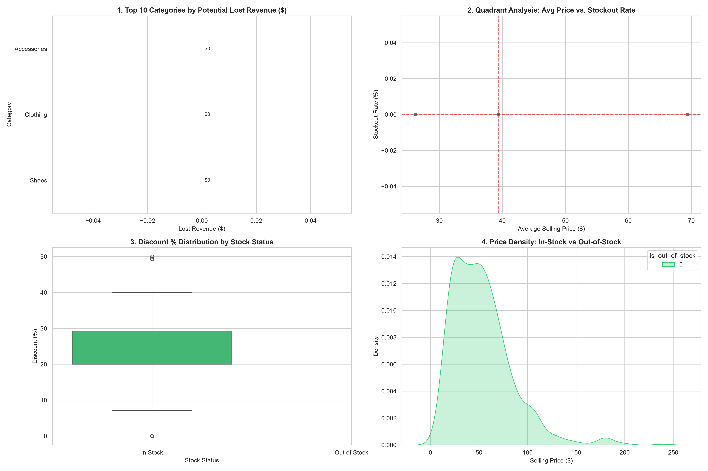

# 👟 Adidas Product Out-Of-Stock & Lost Revenue Analysis

An end-to-end Python data analytics project analyzing inventory availability, stockout metrics, pricing distribution, and potential revenue loss across Adidas products.

---

## 📊 Executive Summary & Key Dashboard



### **Key Metrics Summary**
* **Total Products Analyzed:** 845
* **Out of Stock Items:** 285 products
* **Overall Stockout Rate:** 33.7%
* **Total Estimated Revenue Opportunity Loss:** **$15,828.00**

---

## 🔍 Key Business Insights

1. **Revenue Loss Concentration:** 
   * **Shoes** category accounts for **$12,422** (~78.5%) of total lost revenue due to stockouts.
   * **Accessories** face the highest percentage stockout rate at **46.34%**.

2. **Pricing & Discount Correlation:**
   * Products with stockouts show a higher median discount rate (~30%) compared to in-stock items (~20%), indicating discount promotions trigger high demand velocity leading to inventory exhaustion.

3. **High Density Loss Zone:**
   * The price range of **$60 - $120** faces the sharpest stockout density, identifying core mid-tier performance footwear as the critical restock area.

---

## 🚀 Tech Stack Used

* **Language:** Python 3.12
* **Data Processing:** Pandas, NumPy
* **Data Visualization:** Seaborn, Matplotlib
* **Environment & Version Control:** Jupyter Notebook, Git, GitHub

---

## 📂 Project Structure

```text
├── adidas_usa.csv                 # Raw Adidas USA Product Dataset
├── analysis.ipynb                 # Step-by-step Data Processing & Visualizations
├── images/
│   └── adidas_stockout_dashboard.png # Generated 4-Chart Dashboard
├── .gitignore                     # Git tracking exemptions
└── README.md                      # Executive Project Documentation